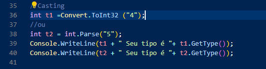
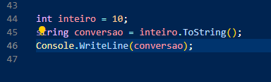
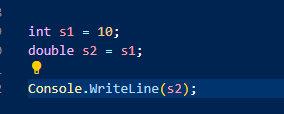
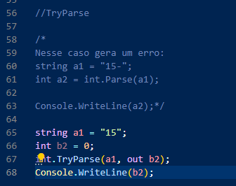
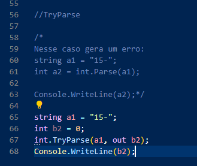
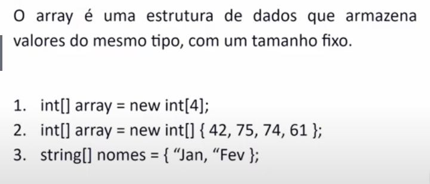

# Aprendendo o .NET

# Sumário

- [Iniciar o projeto](#iniciando-o-projeto):
    - [dotnet new console](#donet-new-console)
    - [Dotnet run](#dotnet-run)
- [Program.cs](#programcs)
- [Criando uma nova Classe](#criar-uma-classe)
- [namespacing](#namespace)
- [Usando a classe](#intanciando-uma-classe)
- [Tipos de dados](#tipos-de-dados)
- [Operadores](#operadores):
    - [Casting](#casting)
    - [Casting implicito](#casting-implicito)
- [Condicionais](#condicional):
 - [if-else](#if-else)
 - [switch case](#switch)
 - [ReadLine](#switch)
- [Operadores Aritmeticos](#operadores-aritmeticos)
    - [Função Math](#mathx)
- [Estrutura de repetição](#estrutura-de-repetição):
    - [For](#for)
    - [While](#while)
    - [Do While](#do-while)
- [Arrays](#arrays)
    - [ForEach](#foreach)
    - [Resize](#redimensionar-um-array-resize)
    - [Copy](#copiando-um-array-para-outro-copy)
- [Listas](#listas)
    - [Adicionar](#adicionar-elemento-na-list)
    - [Remove](#remover-elemento-na-list)

## Donet new console

Inicia um projeto .net com a finalidade de usar como saida o console

## Dotnet run

Compila e executa o meu codigo.


# Program.cs

Ele é a porta de entrada do meu programa, ele é a minha main por onde irei executar o programa

# Criar uma classe:


## Atalho Prop


# NameSpace

Ele é importante para reconhecer a minha classe, pois, ele é o caminho que a minha classe vai ter.

```cs
//Classe Main:
using iniciar.Models;

Pessoa p = new Pessoa();

//Classe filha:

namespace iniciar.Models
{
    public class Pessoa
    {
       ...
    }
}

```

Eu so vou conseguir reconher a minha classse filha pelo caminho dela.

Eu posso por exemplo ter duas classes com o mesmo nome, logo para saber qual eu quero vou ter que usar o namespace:

```dotnet
iniciar.Models.Pessoa p1 = new iniciar.Models.Pessoa();

iniciar.ModelsDois.Pessoa p2 = new iniciar.ModelsDois.Pessoa();

```

Desse jeito **p1** é uma classe e **p2** é outra classe.

# Intanciando uma classe

```cs
using iniciar.Models;

Pessoa P1 = new Pessoa();


P1.Nome = "Samuel";
P1.Idade = 22;

P1.Apresentar();

//Resultado -> Ola meu nome é Samuel, e tenho 22 anos!
```

# Tipos de dados

Ele não se diferencia muito das outras linguagens, é praticamente a mesma coisa que o java


Note que o tipo decimal corta 0 **0** que vem depois do **8**.
Para não cortar tive que transformar ele em outro tipo de dado, que no caso foi uma string


# Operadores:

O **C#** não se diferencia muito de outras linguagens:
```cs
int a = 10;
int b = 20;
int c = a + b;
Console.WriteLine(c);


c = c + 5;
Console.WriteLine(c);
c += 5;
Console.WriteLine(c);
```

## Casting

Nem sempre se vai receber o dado no formato que queremos, nesses casos teremos que tratar esse dado com Casting:



A diferença entre o Convert e o Parse é praticamente como elas tratam o valor null.

Ao passar Null:

Convert --> vai transformar null em 0;
Parse --> Ele vai encerrar o meu programa.

## Convesão de String



Todo tipo pode ser representado em String.
Praticamente tudo tem ToString no **C#**, por causa disso pode apenas escrever `.ToString()`;


## Casting Implicito

Ocorre quando mesmo sendo tipos diferentes ele faz a conversão:



O Int cabe dentro do double, logo, o próprio código transforma ele em double.

## TryParse:

Esse comando vai primeiramente tentar fazer algo, e caso não der certo ele vai realizar outra tarefa.
Dessa forma quando o código der algum erro ele não vai parar a execução.



Note que aqui encima ele vai me dar como resposta **15**.

para ficar mais simples de entender, vamos traduzir:

**Tente implementar a1 no lugar de b2**;



Agora como o **a1** daria um erro, pois, eu estou tentando interpretar ele como um inteiro, sendo que ele é uma string com caracteres não númericos.

Já que estamos usando o TryParse, ele vai **tentar** transformar o **a1** como um inteiro.

Tal operação será falha, logo ele irá substituir o resultado de **a1** para **b2**, dessa forma o código continua rodando.

# Condicional

## IF-Else

```cs
int qtComprada = 3;

int qtEmEstoque = 4;

bool possivelVenda = qtEmEstoque >= qtComprada;

if(possivelVenda){
    Console.WriteLine("Venda realizada");
}else{
    Console.WriteLine("Venda Cancelada");
}
Resultado : Venda Realizada
```


```cs
int qtComprada = 5;

int qtEmEstoque = 4;

bool possivelVenda = qtEmEstoque >= qtComprada;

if(possivelVenda){
    Console.WriteLine("Venda realizada");
}else{
    Console.WriteLine("Venda Cancelada");
}
Resultado : Venda Cancelada
```

```cs
int qtComprada = 3;

int qtEmEstoque = 4;

bool possivelVenda = qtEmEstoque >= qtComprada;

if(qtComprada == 0){
    Console.WriteLine("Venda Invalida");
}else if(possivelVenda){
    Console.WriteLine("Venda realizada");
}else{
    Console.WriteLine("Venda Cancelada");
}
Resultado : Venda Realizada
```

## Switch

```cs
Console.WriteLine("Digite uma letra");
string letra = Console.ReadLine().ToLower();
ReadLine()--> é um comando que espera uma resposta do console

switch (letra)
{
    case "a":
    case "e":
    case "i":
    case "o":
    case "u":
        Console.WriteLine("Vogal");
    break;

    default:
        Console.WriteLine("Nãe é uma vogal");
    break;
}
```

# Operadores Aritmeticos:

com o código abaixo eu consigo fazer contas simples

```cs 
using System;
using System.Collections.Generic;
using System.Linq;
using System.Threading.Tasks;

namespace iniciar.Models
{
    public class Calculadora
    {
        public void Somar(int x, int y){
            Console.WriteLine($"{x} + {y} = {x + y}" );
        }
        public void Subtrair(int x, int y){
            Console.WriteLine($"{x} - {y} = {x - y}" );
        }
        public void Dividir(int x, int y){
            Console.WriteLine($"{x} / {y} = {x / y}" );
        }
        public void Multiplicar(int x, int y){
            Console.WriteLine($"{x} * {y} = {x * y}" );
        }
    }
}

//Na minha main

Calculadora calc = new Calculadora();

Calculadora calc = new Calculadora();

calc.Somar(3, 5);
calc.Subtrair(3,6);
calc.Multiplicar(2,2);
calc.Dividir(50,5);
calc.Potencia(5,2);
calc.RaizQuadrada(9);
calc.Tan(30);
calc.Sen(30);
calc.Cos(30);
```

## Math.X

Com a biblioteca Math se consegue fazer alguns calculos mais complexos, e até mesmo algumas abreviações:

```cs
        public void Potencia(int x, int y){
            double resultado = Math.Pow(x, y);
            Console.WriteLine($"{x} ** {y} = {resultado}" );
        }
        public void RaizQuadrada(int x){
            double resultado = Math.Sqrt(x);
            Console.WriteLine($"Raiz quadrada de {x} = {Math.Round(resultado, 3)}");
        }

        public void Sen(double angulo){
            double radiano = angulo * Math.PI / 180;
            double seno = Math.Sin(radiano);
            Console.WriteLine($"Seno de {angulo} = {Math.Round(seno ,4)}");
        }
        public void Cos(double angulo){
            double radiano = angulo * Math.PI / 180;
            double coseno = Math.Cos(radiano);
            Console.WriteLine($"Coseno de {angulo} = {Math.Round(coseno,4)}");
        }
        public void Tan(double angulo){
            double radiano = angulo * Math.PI / 180;
            double tangente = Math.Tan(radiano);
            Console.WriteLine($"Tangente de {angulo} = {Math.Round(tangente,4)}");
        }
```

Como eu disse anteriormente, o C# não se diferencia muito das outras linguagens.

# Estrutura de repetição:

Nada de diferente das outras linguagens:

## For
```cs
Console.WriteLine("Digite um número");
int numeroConvertido = Convert.ToInt32(Console.ReadLine());
Console.WriteLine($"Tabuada do {numeroConvertido}");

for (int i = 0; i <= 10; i++)
{
        Console.WriteLine($"{numeroConvertido} X {i} = {numeroConvertido * i}");
}
```

# While

```cs
Console.WriteLine("Digite um número");
int numeroConvertido = Convert.ToInt32(Console.ReadLine());
Console.WriteLine($"Tabuada do {numeroConvertido}");

int contador = 0;

while (contador <= 10)
{
    Console.WriteLine($"{numeroConvertido} X {contador} = {numeroConvertido * contador}");
    contador++;
}
```

## Do While

```cs
Console.WriteLine("Digite um número");
int numeroConvertido = Convert.ToInt32(Console.ReadLine());
Console.WriteLine($"Tabuada do {numeroConvertido}");
int contador = 0;

do
{
    Console.WriteLine($"{numeroConvertido} X {contador} = {numeroConvertido * contador}");
    contador++;
} while (contador <= 10);
```


# Arrays



```cs

int[] arrayDeInterios = new int[3];
arrayDeInterios[0] = 10;
arrayDeInterios[1] = 15;
arrayDeInterios[2] = 100;
for (int i = 0; i < arrayDeInterios.Length; i++)
{
    Console.WriteLine($"posição numero {i} --- valor..: {arrayDeInterios[i]}");
}
Resultado:
posição numero 0 --- valor..: 10
posição numero 1 --- valor..: 15
posição numero 2 --- valor..: 100

```

## ForEach

foreach é uma construção usada para iterar sobre coleções, como arrays e coleções baseadas em interfaces.

```cs
int contadorForEach = 0;

foreach(int valor in arrayDeInterios){
    Console.WriteLine($"posição numero {contadorForEach} --- valor..: {valor}");
    contadorForEach++;
}
```

## Redimensionar um array (Resize)

Quando cria um array ele tem um tamanho pré-definido pelo proprio programador, porém, el alguns casos, é preciso mudar o tamanho dele.

Para alterar isso podemos usar como alternativa a classe **Resize()**:

***Array.Resize(ref NomeDoArray, NovoTamanho)***

OBS: O Array.Resize funciona como uma criação de um novo array, logo, ele não modifica o meu array, mas sim copia o array.


```cs
int[] arrayDeInterios = new int[3];
arrayDeInterios[0] = 10;
arrayDeInterios[1] = 15;
arrayDeInterios[2] = 100;

Array.Resize(ref arrayDeInterios, arrayDeInterios.Length * 2);
arrayDeInterios[3] = 10;
arrayDeInterios[4] = 15;
arrayDeInterios[5] = 100;
for (int i = 0; i < arrayDeInterios.Length; i++)
{
    Console.WriteLine($"posição numero {i} --- valor..: {arrayDeInterios[i]}");
}

resultado: 
posição numero 0 --- valor..: 10
posição numero 1 --- valor..: 15
posição numero 2 --- valor..: 100
posição numero 3 --- valor..: 10
posição numero 4 --- valor..: 15
posição numero 5 --- valor..: 100
```

## Copiando um array para outro (Copy)


 o método Array.Copy é usado para copiar elementos de uma matriz para outra matriz. 
 Ele permite copiar uma parte de uma matriz para outra, com ou sem redimensionamento.

***Array.Copy(ArrayCopiado ,ArrayDeDestino, QuantidadeQueQuerCopiar)***

```cs
int[] arrayDeInterios = new int[3];
arrayDeInterios[0] = 10;
arrayDeInterios[1] = 15;
arrayDeInterios[2] = 100;

int[] arrayInteirosDobrados = new int[arrayDeInterios.Length * 2];

Array.Copy(arrayDeInterios, arrayInteirosDobrados, arrayDeInterios.Length);

for (int i = 0; i < arrayInteirosDobrados.Length; i++)
{
    Console.WriteLine($"posição numero {i} --- valor..: {arrayInteirosDobrados[i]}");
}
resultado:

posição numero 0 --- valor..: 10
posição numero 1 --- valor..: 15
posição numero 2 --- valor..: 100
posição numero 3 --- valor..: 0
posição numero 4 --- valor..: 0
posição numero 5 --- valor..: 0
```


# Listas

Uma lista é um array "melhorado".

EM um array tem que passar uma capacidade maxima para ele, já para uma lista não é necessário.

Ela funciona como se fosse uma extensão de um array.


***List&lt;TipoDedado&gt; nomeDaLista = new List&lt;TipoDedado&gt;()***

## Adicionar elemento na List

para adicionar elementos:

***NomeDaLista.Add(elemento)***


```cs
List<string> listaDeEstados = new List<string>();
listaDeEstados.Add("MG");
listaDeEstados.Add("SP");
listaDeEstados.Add("GO");
listaDeEstados.Add("RS");
listaDeEstados.Add("RN");
for(int i = 0; i < listaDeEstados.Count; i++){
    Console.WriteLine($"posição N°{i} -- {listaDeEstados[i]}");
}
resultado:
posição N°0 -- MG
posição N°1 -- SP
posição N°2 -- GO
posição N°3 -- RS
posição N°4 -- RN

OBS: Count funciona como se fosse o lenght
```


```cs
List<string> listaDeEstados = new List<string>();
listaDeEstados.Add("MG");
listaDeEstados.Add("SP");
listaDeEstados.Add("GO");
listaDeEstados.Add("RS");
listaDeEstados.Add("RN");
Console.WriteLine($"Itens da minha Lista: {listaDeEstados.Count}");
listaDeEstados.Add("SC");
Console.WriteLine($"Itens da minha Lista: {listaDeEstados.Count}");

Resultado:
Itens da minha Lista: 5
Itens da minha Lista: 6
```


## Remover elemento na List

Existe duas maneira simples de remover um elemento na List.

1- Por meio do ***List.Remove(ElementoASerRemovido)***;

2- Usando o ***List.RemoveAt(IndiceDoElementoASerRemovido)***

```cs
List<int> listaDeInteiros = new List<int>{1,2,3,4,5};
listaDeInteiros.Remove(3);//Remove pelo elemento
//listaDeInteiros = {1,2,4,5}
//OBS: ele vai eliminar apenas o primeiro elemento que ele encontrar na List
//Caso tenha mais de um elemento igual ele apenas vai eliminar 1, para eliminar todos vai precisar fazer um loop
```

```cs
List<int> listaDeInteiros = new List<int>{1,2,3,4,5};
listaDeInteiros.RemoveAt(1);//Remove pelo indice
//listaDeInteiros = {1,3,4,5}
```